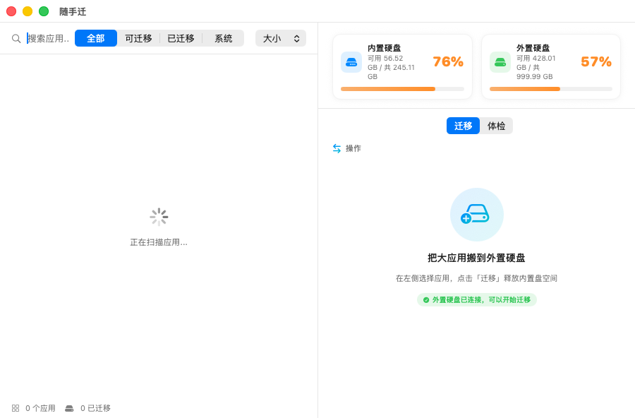

# 随手迁

把 macOS 大应用搬到外置硬盘、给内置盘腾空间的工具。迁移后 `/Applications` 里留一个软链接，应用照常启动、照常升级，使用方式完全不变。



## 功能特性

- **一键迁移 / 回迁**：单个迁移或批量搬运，链接对用户透明，启动台、Spotlight、Dock 全部照旧
- **外置盘原住民应用**：安装时就装在外置盘的应用（如 WPS）也会出现在列表（「在外置盘」徽章），可一键搬回内置盘
- **链接体检**：软链接按「正常 / 硬盘未连接 / 断链」三态分类，断链按迁移台账自动自愈（卷改名免疫），也可手动修复；备份孤儿与超龄备份审计清理
- **应用数据迁移（⌘3 数据面板）**：自动发现剪映草稿、LM Studio 模型、Docker 磁盘镜像、iPhone 备份等大数据目录；优先给应用自带的搬迁指引，苹果没给入口的走同级别安全链的链接迁移；拔盘分叉自动对账
- **升级回退检测**：应用自升级把链接换回真目录时体检会发现，一键重新迁移释放内置盘
- **空间守卫**：内置盘低于 40GB 自动告警，附可迁移应用清单与预计腾出空间
- **新应用提醒**：新装 ≥500MB 应用主动问要不要搬（防复发：大应用总会再住回内置盘）
- **大文件 TOP / 残留扫描**：体检页可查 ≥500MB 大文件、已卸载应用的无主数据，清理走废纸篓
- **设置窗口（⌘,）**：提醒开关、备份保留期、审计日志直达、插盘自动打开

## 安全设计（本项目北极星）

把「迁移 + 省空间」的安全与稳定做到极致，数据安全链条无已知缺口：

| 环节 | 措施 |
|---|---|
| 迁移前 | 目标盘挂载点 + 剩余空间校验；应用正在运行则拒绝迁移；APFS 本地快照整机保险（1 小时节流） |
| 迁移中 | `ditto` 复制保留全部元数据 → 逻辑字节数对比 → 随机抽样 SHA256（≤32 文件全量哈希） |
| 迁移后 | 校验通过才原子切换软链接；任一步失败自动回滚；外置盘 `.suishouqian-backup` 留底（保留期可调，过期自动清理）；卷 UUID 台账记账 |
| 使用期 | 卷改名断链按台账自动自愈（插盘/启动时触发）；应用升级撤销迁移会被体检发现并可一键重新迁移 |
| 全程 | append-only 审计日志；迁移进行中强退需二次确认；拔盘时点名仍在盘上运行的应用 |

工程侧沉淀：所有子进程「先读输出再等待退出」防管道死锁、阻塞等待全部走 GCD 不占 Swift 协作线程池、扫描并发限流（两次真实冻结事故的修复经验，见 CHANGELOG）。

## 快捷键

| 快捷键 | 功能 |
|---|---|
| ⌘R | 重新扫描应用 |
| ⌘F | 聚焦搜索框 |
| ⌘1 / ⌘2 / ⌘3 | 切换 迁移 / 体检 / 数据 面板 |
| ⌘, | 打开设置 |

Dock 右键图标可直达：立即扫描、三个面板。

## 系统要求

- macOS 14.0 及以上（Apple Silicon / Intel）
- 外置硬盘建议 APFS 格式

## 使用

1. 插上外置硬盘，打开随手迁（可在设置里开启「插盘自动打开」）
2. 左侧选择应用点「迁移」，或直接「一键迁移全部」
3. 之后照常用应用——链接在 `/Applications`，本体在外置盘
4. 想搬回来：点「全部回迁」，或体检页单独处理

## 构建与测试

```bash
swift build        # 编译
swift test         # 单元测试（链接三态、残留匹配、审计日志隔离、防死锁回归等）
bash build.sh      # 构建 + 签名 + 安装到 /Applications + 启动（覆盖旧版，旧版进废纸篓）
```

## 项目结构

```
Sources/Suishouqian/
├── App.swift                  # 入口、AppState、强退保护、空间守卫
├── Services/
│   ├── AppMigrator.swift      # 迁移/回迁/卸载核心（校验、回滚、备份清理）
│   ├── AppScanner.swift       # /Applications 扫描（并行 TaskGroup）
│   ├── DiskMonitor.swift      # 磁盘容量与挂载/卸载监听
│   └── HealthChecker.swift    # 链接三态/备份审计/残留扫描/大文件
├── Utilities/                 # AuditLog / FileVerifier / OffPool / Permissions
└── Views/                     # Design.swift 设计系统 + 各面板
```

## 常见问题

- **体检会弹「想访问下载/桌面文件夹」的权限框吗？** 不会。大文件扫描默认只碰「资源库」，且已彻底移除任何对受保护目录的探测；桌面/文稿/下载需在 设置 → 通用 里显式开启扩展扫描（开启前引导授予完全磁盘访问权限），不开启就永不触碰。
- **外置盘改名后链接断了？** 插上硬盘随手迁会按迁移台账里的卷 UUID 自动重写链接（发通知告知），无需手动处理；极端情况可用体检页手动修复。
- **应用自升级后又回到内置盘？** 个别更新器会用真目录替换链接（"迁移被悄悄撤销"）。体检页「迁移被撤销」分区会发现它，一键重新迁移即可释放内置盘空间。
- **拔盘后应用打不开？** 正常现象，插回即恢复。拔盘前建议先退出住在外置盘的应用，随手迁会点名提醒。
- **Time Machine / 挂载 dmg 会误触发「插盘自动打开」吗？** 不会：守护只监听目标盘的挂载点，且只在「未挂载 → 已挂载」的瞬间触发一次。
- **应用数据（素材、模型）会一起搬吗？** 暂不。数据目录和程序本体行为不同（持续热写入、断链后有数据分叉风险），规划为独立能力分阶段上线（见路线图）。

## 路线图

- **v3.0 工程化收官**：Developer ID 签名 + 公证 + DMG + Sparkle appcast + GitHub Actions CI
- 备选：任意大目录的手动链接迁移（当前仅清单内目录）、数据分叉的内容合并向导、多盘支持

## 更新日志

见 [CHANGELOG.md](CHANGELOG.md)。
